# 🚀 Dynamic DataTable Extension for Azure DevOps
## From Zero to Production: Complete Development Journey

---

# 🎯 What We're Building Today

## Before: Limited Azure DevOps Fields
```
Work Item
├── Title: [text field]
├── Description: [text area]  
├── Priority: [dropdown]
└── Status: [dropdown]
```
❌ **Limited to Microsoft's predefined fields**

## After: Dynamic Data Tables
```
Work Item
├── Standard Fields
└── Custom Data Table ✨
    ├── Fully configurable columns
    ├── Multiple data types
    ├── Advanced filtering
    └── Auto-save functionality
```
✅ **Unlimited customization possibilities**

---

# 🌐 Extension Ecosystem Overview

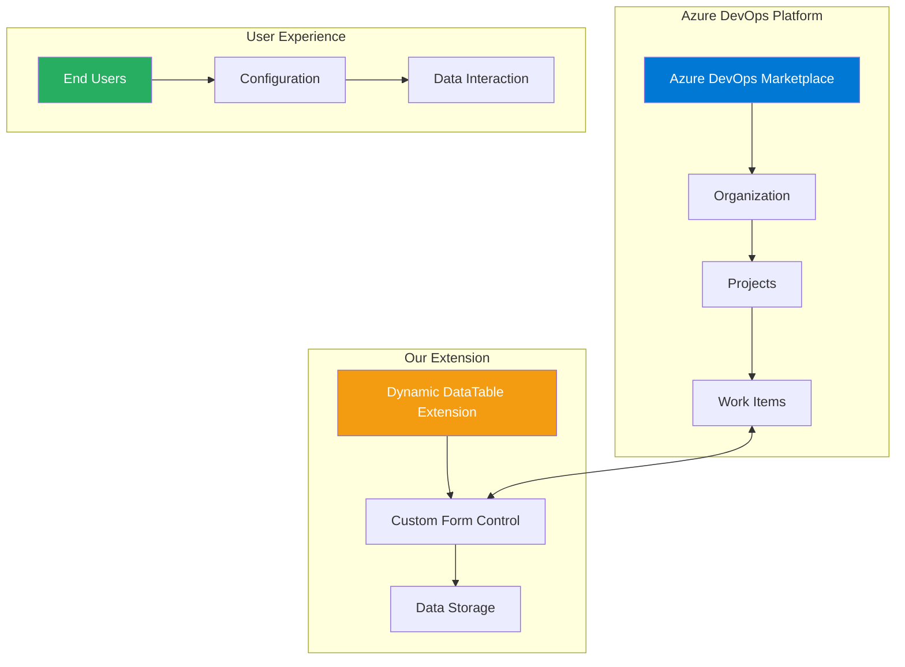

**Three Key Players:**
- 🔧 **Extension Developer** (us) - Build and publish
- 👨‍💼 **Organization Admin** - Install and configure  
- 👥 **End Users** - Use tables in daily work

---

# 🛠️ Technology Stack

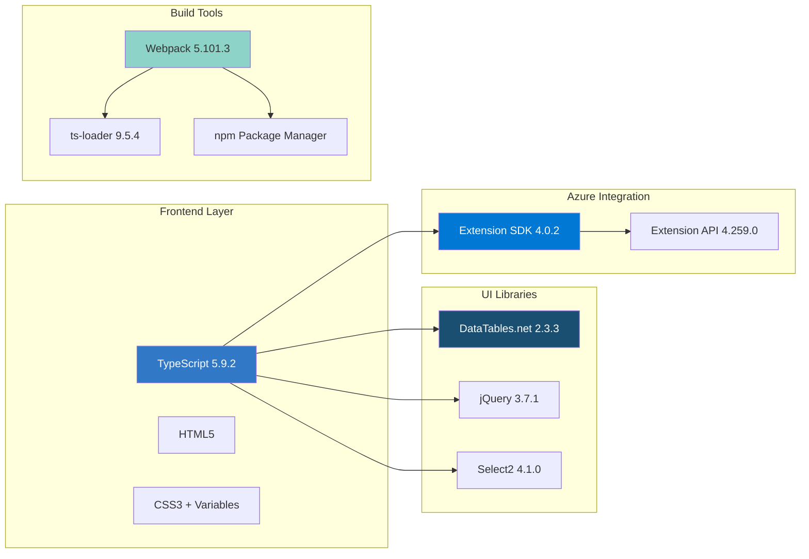

**Why These Choices:**
- **TypeScript**: JavaScript with types → prevents bugs
- **DataTables.net**: Enterprise table functionality out of the box
- **Azure DevOps SDK**: Microsoft's official, supported APIs
- **Webpack**: Modern build system for deployment

---

# 📁 Project Structure

```
📁 dynamic-datatable-extension/
├── 📁 src/                          # Source code
│   ├── 📄 index.ts                  # Main logic (759 lines)
│   ├── 📄 index.html                # UI template
│   └── 📄 styles.css                # Custom styling
├── 📁 dist/                         # Built output (generated)
├── 📁 images/                       # Extension assets
├── 📄 package.json                  # Project configuration
├── 📄 tsconfig.json                 # TypeScript configuration
├── 📄 webpack.config.js             # Build configuration
└── 📄 vss-extension.json            # Extension manifest ⭐
```

**Key Files:**
- **vss-extension.json** - Contract with Azure DevOps
- **src/index.ts** - All our logic (759 lines we'll explore)
- **package.json** - Dependencies and build scripts
- **webpack.config.js** - How to bundle for deployment

---

# 📋 Extension Manifest - The Contract

```json
{
  "manifestVersion": 1,
  "id": "custom-data-table-control-v10",
  "publisher": "your-publisher",
  "version": "8.4.32",
  "name": "Data Table Extension",
  "contributions": [
    {
      "id": "custom-data-table-control-dt-v3",
      "type": "ms.vss-work-web.work-item-form-control",
      "properties": {
        "name": "Custom Data Table (DataTables) v3",
        "uri": "dist/index.html",
        "inputs": [
          {
            "id": "DataFieldRefName",
            "name": "Data field (reference name)",
            "type": "WorkItemField"
          },
          {
            "id": "ColumnConfiguration", 
            "name": "Column Configuration (JSON)",
            "type": "string"
          }
        ]
      }
    }
  ]
}
```

**Key Sections:**
- **contributions** - What we're adding to Azure DevOps
- **type** - Specifically a work item form control
- **inputs** - Configuration options for admins

---

# 🔄 Data Flow Architecture

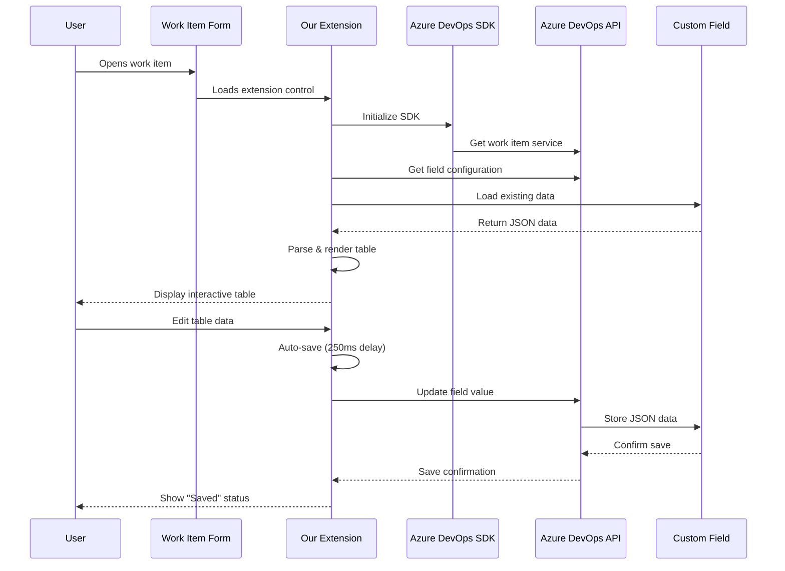

**Key Phases:**
1. **Loading** - Initialize and load existing data
2. **Interaction** - User edits with auto-save
3. **Persistence** - Data stored as JSON in custom field

---

# 🏗️ TypeScript Foundation

## Type Definitions
```typescript
// Legacy type for backward compatibility
type Row = { 
  id: number; 
  name: string; 
  estimate: number; 
  done: boolean 
};

// New dynamic types
interface ColumnDefinition {
  id: string;                    // Unique identifier
  name: string;                  // Display name
  dataType: 'string' | 'number' | 'boolean' | 'date' | 'dropdown';
  required?: boolean;            // Validation
  width?: string;               // CSS width
  defaultValue?: any;           // Default for new rows
  options?: string[];           // For dropdown type
}

interface TableConfiguration {
  columns: ColumnDefinition[];
}

// Dynamic row type - flexible key-value pairs
type DynamicRow = { 
  [columnId: string]: any; 
  _id?: number 
};
```

**Benefits:**
- ✅ **Type Safety** - Prevents bugs at compile time
- ✅ **Self-Documenting** - Types explain the structure
- ✅ **IDE Support** - Autocomplete and error detection
- ✅ **Flexibility** - Dynamic rows adapt to any configuration

---

# ⚙️ Configuration System

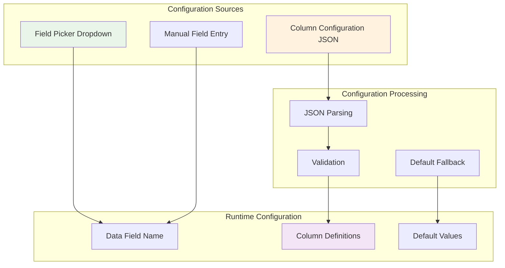

## Field Configuration
```typescript
function getConfiguredField(): string {
  const cfg = SDK.getConfiguration() as any;
  const picker = cfg?.witInputs?.DataFieldRefName?.trim?.();
  const manual = cfg?.witInputs?.DataFieldRefNameText?.trim?.();
  const chosen = (picker || manual || dataFieldRefName) as string;
  return chosen;
}
```

**Defensive Programming:** Try picker → manual → default fallback

---

# 🛡️ Data Sanitization Pipeline

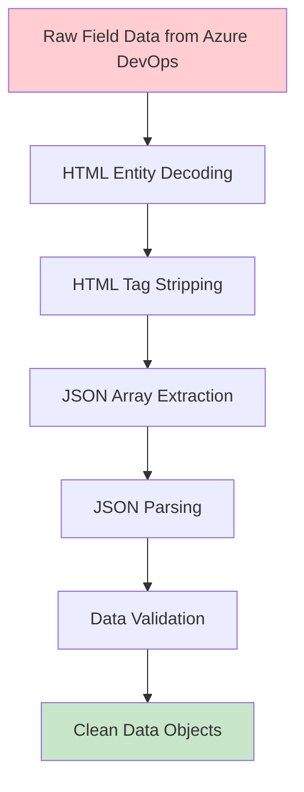

## Security-First Approach
```typescript
function decodeHtmlEntities(s: string): string {
  return s
    .replace(/&quot;/g, '"')
    .replace(/&#39;/g, "'")
    .replace(/&lt;/g, "<")
    .replace(/&gt;/g, ">")
    .replace(/&amp;/g, "&");
}

function stripHtmlTags(s: string): string {
  return s.replace(/<\/?[^>]+>/g, "").replace(/\u00A0/g, " ").trim();
}
```

**Why This Matters:** Azure DevOps fields can contain HTML - we safely extract JSON

---

# 🎨 Dynamic UI Generation

```mermaid
graph TB
    subgraph "Column Configuration"
        STRING[String Column]
        NUMBER[Number Column]
        BOOLEAN[Boolean Column]
        DATE[Date Column]
        DROPDOWN[Dropdown Column]
    end
    
    subgraph "Generated HTML Controls"
        TEXT_INPUT[<input type="text">]
        NUM_INPUT[<input type="number">]
        CHECKBOX[<input type="checkbox">]
        DATE_INPUT[<input type="date">]
        SELECT[<select><option>...]
    end
    
    subgraph "DataTables Integration"
        RENDER[Custom Render Function]
        SEARCH[Search/Sort Logic]
        EVENTS[Event Binding]
    end
    
    STRING --> TEXT_INPUT
    NUMBER --> NUM_INPUT
    BOOLEAN --> CHECKBOX
    DATE --> DATE_INPUT
    DROPDOWN --> SELECT
    
    TEXT_INPUT --> RENDER
    NUM_INPUT --> RENDER
    CHECKBOX --> RENDER
    DATE_INPUT --> RENDER
    SELECT --> RENDER
    
    RENDER --> SEARCH
    SEARCH --> EVENTS
    
    style STRING fill:#e8f5e8
    style TEXT_INPUT fill:#fff3e0
    style RENDER fill:#f3e5f5
```

## Smart Rendering
```typescript
function generateCellInput(column: ColumnDefinition, data: any): string {
  switch (column.dataType) {
    case 'string':
      return `<input type="text" value="${escapedValue}" />`;
    case 'number':
      return `<input type="number" value="${Number(value)}" />`;
    case 'boolean':
      return `<input type="checkbox" ${value ? 'checked' : ''} />`;
    case 'dropdown':
      return `<select>${optionElements}</select>`;
  }
}
```

**DataTables Integration:** Different output for display vs search vs sort

---

# 🔍 Advanced Filtering System

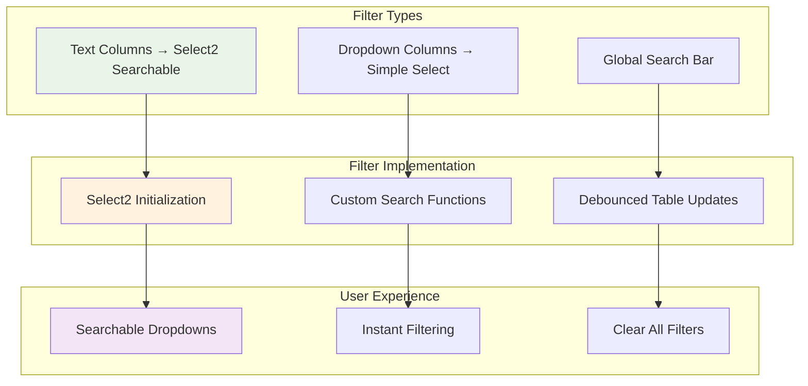

**Smart Filter Logic:**
- **Text Columns** → Searchable Select2 dropdowns
- **Dropdown Columns** → Simple HTML selects
- **Automatic Adaptation** → Based on column configuration

---

# 💾 Auto-Save System

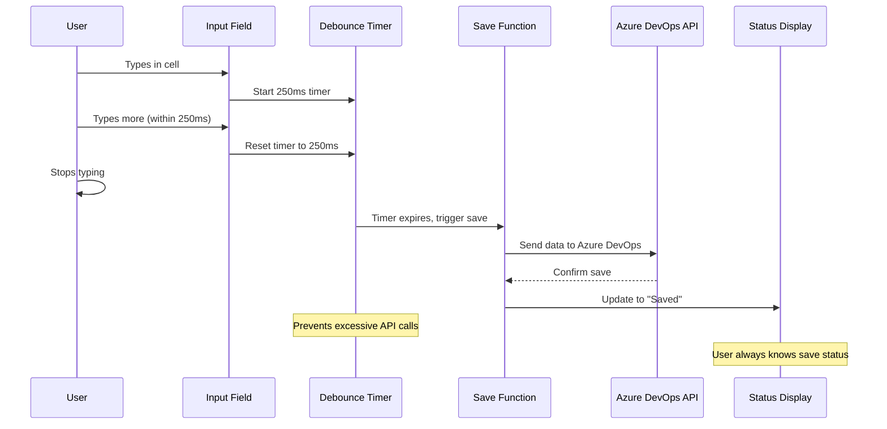

## Debouncing Implementation
```typescript
let dirtyDebounce: number | undefined;

async function markDirty() {
  window.clearTimeout(dirtyDebounce);
  dirtyDebounce = window.setTimeout(async () => {
    const payload = JSON.stringify(getRowsFromTable());
    const ok = await workItemService!.setFieldValue(dataFieldRefName, payload);
    setStatus(ok ? "Saved" : "Error saving");
  }, 250);
}
```

**Key Benefits:**
- ✅ **Smooth UX** - Immediate feedback
- ✅ **API Efficient** - Batches rapid changes
- ✅ **Status Awareness** - Users always know save state

---

# 🔄 Data Migration System

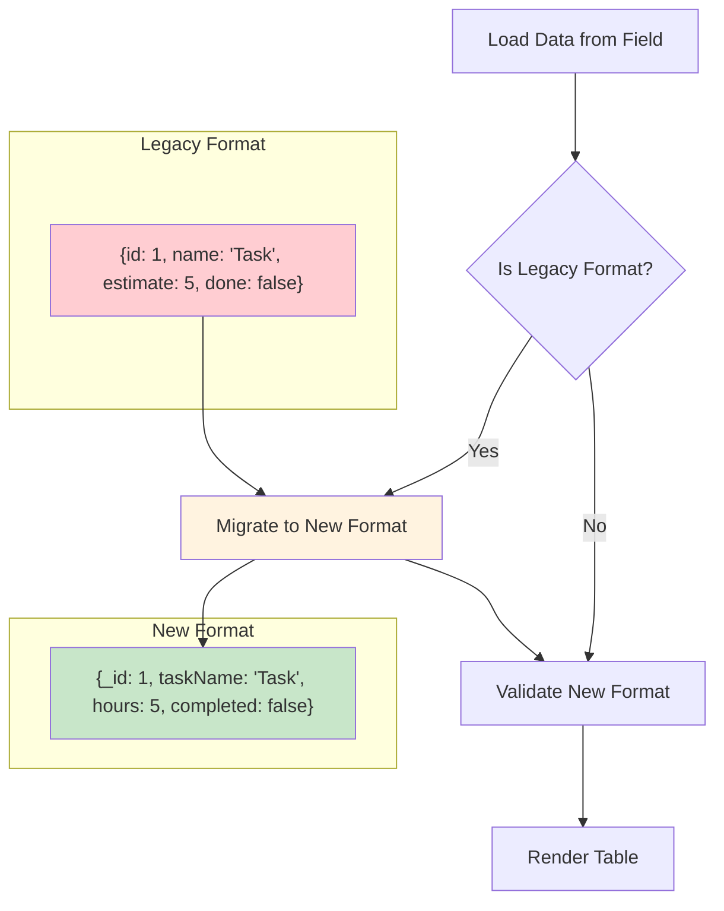

## Backward Compatibility
```typescript
function isLegacyRow(row: any): boolean {
  return row && 
         typeof row === 'object' && 
         ('name' in row || 'estimate' in row || 'done' in row) &&
         !('_id' in row);
}

function migrateLegacyRow(legacyRow: any, columnConfig: TableConfiguration): DynamicRow {
  const row: DynamicRow = { _id: legacyRow.id || defaultId };
  // Map old properties to new column configuration
  columnConfig.columns.forEach(col => {
    row[col.id] = legacyRow[col.id] ?? col.defaultValue;
  });
  return row;
}
```

**Enterprise Principle:** Never break existing user data

---

# 🎨 CSS Architecture & Theming

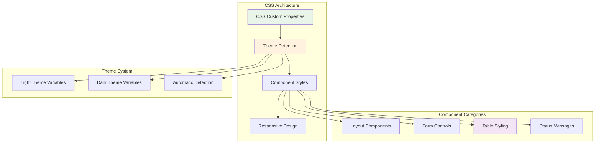

## Theme Integration
```css
:root {
  --az-bg: #ffffff;
  --az-text: #242424;
  --az-primary: #0078d4;
}

@media (prefers-color-scheme: dark) {
  :root {
    --az-bg: #1f1f1f;
    --az-text: #f3f3f3;
    --az-primary: #3aa0ff;
  }
}

.azdo-btn {
  background: var(--az-bg);
  color: var(--az-text);
  border: 1px solid var(--az-border);
}
```

**Result:** Seamless integration with Azure DevOps themes

---

# 🏗️ Build System - Webpack

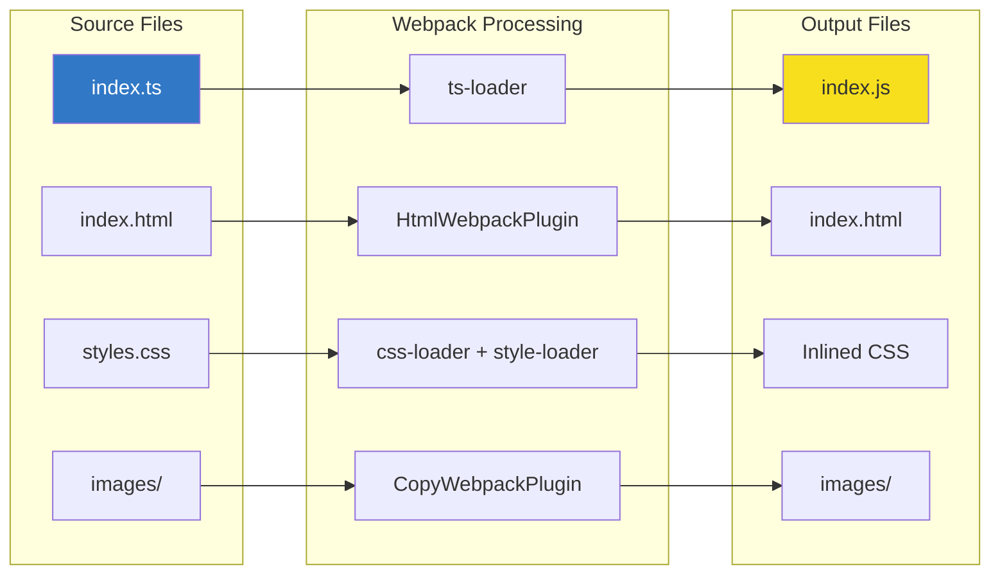

## Build Configuration
```javascript
module.exports = {
  entry: { index: "./src/index.ts" },
  output: { path: "dist", filename: "[name].js" },
  module: {
    rules: [
      { test: /\.ts$/, use: "ts-loader" },
      { test: /\.css$/, use: ["style-loader", "css-loader"] }
    ]
  },
  plugins: [
    new HtmlWebpackPlugin({ template: "src/index.html" }),
    new CopyWebpackPlugin({ patterns: [{ from: "images" }] })
  ]
};
```

**Output:** Single HTML file with embedded JS/CSS - perfect for extensions

---

# 🔄 Extension Lifecycle Management

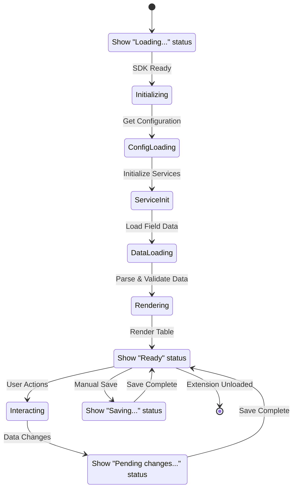

## Lifecycle Events
```typescript
const provider = () => ({
  onLoaded: async () => {
    // Initialize extension, load configuration, render UI
  },
  onFieldChanged: async (args: any) => {
    // Handle external field changes (ignore our own)
  },
  onSaved: async () => {
    // Work item was saved
  },
  onUnloaded: () => {
    // Cleanup if needed
  }
});
```

**Key Principle:** Always keep users informed of current state

---

# 🛡️ Error Handling & Debugging

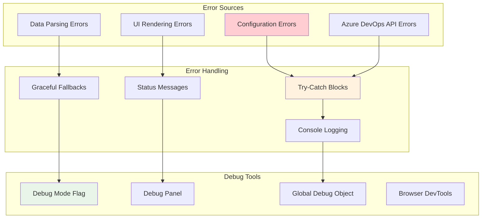

## Defensive Programming
```typescript
try {
  const result = await riskyOperation();
  return result;
} catch (error) {
  log("Operation failed:", error);
  setStatus("Error: " + error.message);
  return defaultValue; // Graceful fallback
}

// Global debug object for runtime inspection
(window as any).dtctl = { 
  version: VERSION, 
  data: () => getRowsFromTable(),
  config: getColumnConfiguration()
};
```

**Philosophy:** Fail gracefully, never crash, always inform users

---

# ⚡ Performance Optimization

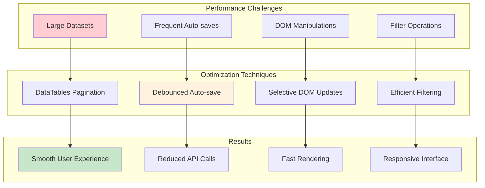

**Key Optimizations:**
- ✅ **250ms debounced auto-save** - Prevents API spam
- ✅ **DataTables pagination** - Lightweight DOM (10-25 rows/page)
- ✅ **Selective DOM updates** - Only change what's necessary
- ✅ **Efficient data structures** - Right tool for the job

**Result:** Fast, responsive extension even with complex data

---

# 🚀 Deployment Pipeline

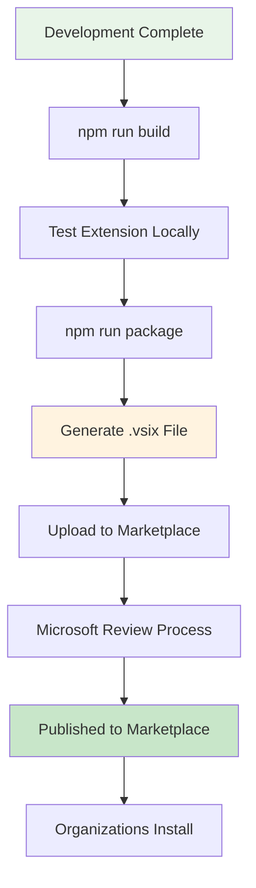

## Build Commands
```bash
# Development build with watch
npm run dev

# Production build
npm run build

# Package extension
npm run package

# Publish to marketplace
npm run publish
```

**Process:**
1. Build → Optimize files
2. Package → Create .vsix file
3. Upload → Submit to marketplace
4. Review → Microsoft approval (1-2 days)
5. Publish → Available to organizations worldwide

---

# 🌟 Real-World Usage Examples

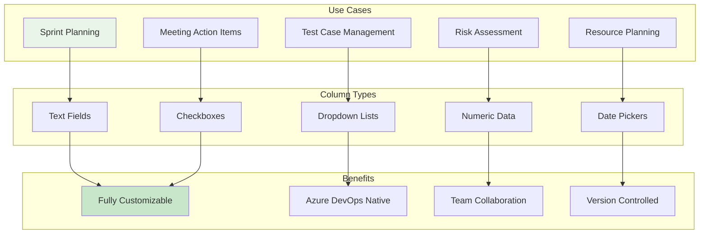

## Sprint Planning Configuration
```json
{
  "columns": [
    {"id": "story", "name": "User Story", "dataType": "string", "required": true},
    {"id": "points", "name": "Story Points", "dataType": "number"},
    {"id": "assignee", "name": "Developer", "dataType": "string"},
    {"id": "status", "name": "Status", "dataType": "dropdown", 
     "options": ["To Do", "In Progress", "Done"]}
  ]
}
```

## Test Case Management
```json
{
  "columns": [
    {"id": "testCase", "name": "Test Case", "dataType": "string", "required": true},
    {"id": "priority", "name": "Priority", "dataType": "dropdown",
     "options": ["Critical", "High", "Medium", "Low"]},
    {"id": "result", "name": "Result", "dataType": "dropdown",
     "options": ["Not Run", "Passed", "Failed", "Blocked"]}
  ]
}
```

**Same Extension, Different Use Cases** - Power of configuration

---

# 💡 Key Lessons Learned

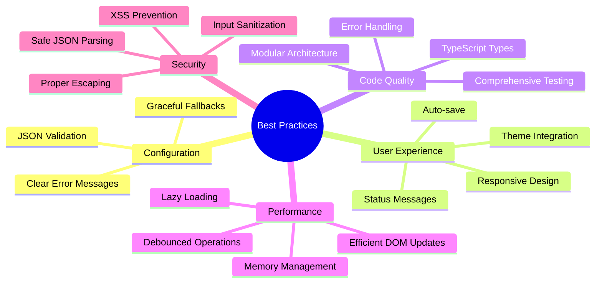

**Critical Insights:**
- 🎯 **Configuration is King** - Makes extension incredibly flexible
- 🎨 **UX Details Matter** - Auto-save, status messages, theme integration
- 🛡️ **TypeScript Pays Off** - Prevents countless bugs
- ⚡ **Performance = UX** - Users judge by feel, not specs
- 🔒 **Security First** - Built in, not bolted on

**These principles apply to ANY enterprise software development**

---

# 🚀 Future Enhancement Roadmap

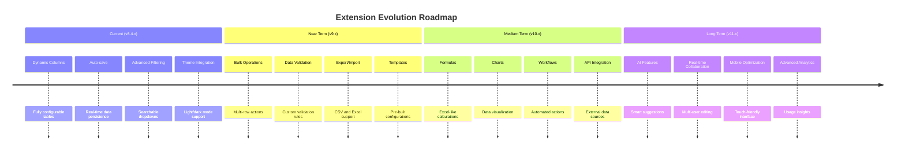

**Vision:** From simple table extension → comprehensive data management platform

---

# 🎯 What We've Accomplished Today

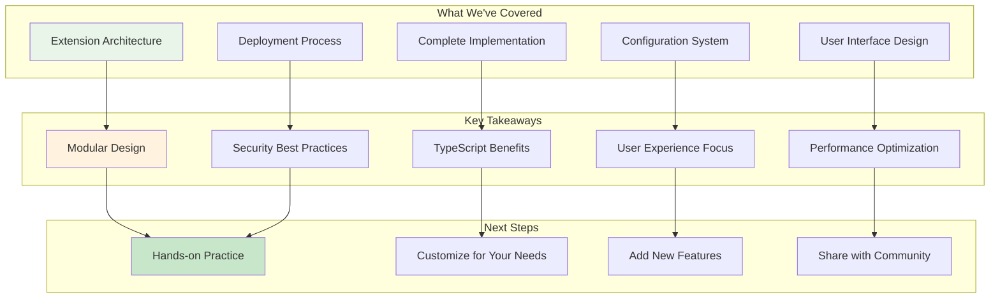

## Complete Journey: Zero → Production
✅ **759 lines of TypeScript** - Every line explained  
✅ **Extension Architecture** - How Azure DevOps extensions work  
✅ **Configuration System** - Dynamic, flexible, powerful  
✅ **UI Design Principles** - Enterprise-grade user experience  
✅ **Build & Deployment** - From code to marketplace  
✅ **Performance & Security** - Production-ready best practices  

## Your Next Steps
1. 📥 **Download** complete code and documentation
2. 🛠️ **Set up** development environment  
3. 🧪 **Experiment** with different configurations
4. 🎨 **Customize** for your organization's needs
5. 🚀 **Build** something amazing for your teams

---

# ❓ Questions & Discussion

## Ready to Answer:
- 🔧 **Technical implementation details**
- 🐛 **Troubleshooting specific issues**  
- 🎨 **Customization strategies**
- ⚡ **Performance optimization techniques**
- 🛡️ **Security considerations**
- 🚀 **Deployment and maintenance**

## Resources Available:
- 📖 **Complete source code** (759 lines explained)
- 📋 **Configuration examples** for various use cases
- 🔧 **Troubleshooting guide** for common issues
- 🔗 **Documentation links** and references

---

# 🎉 Thank You!

## Remember: The best way to learn is by doing

**Take this foundation and build something amazing for your teams!**

### Contact & Resources
- 📧 **Follow-up questions welcome**
- 🔗 **Complete documentation available**
- 💻 **Source code ready for download**
- 🤝 **Community contributions encouraged**

**Let's build the future of Azure DevOps together!** 🚀
